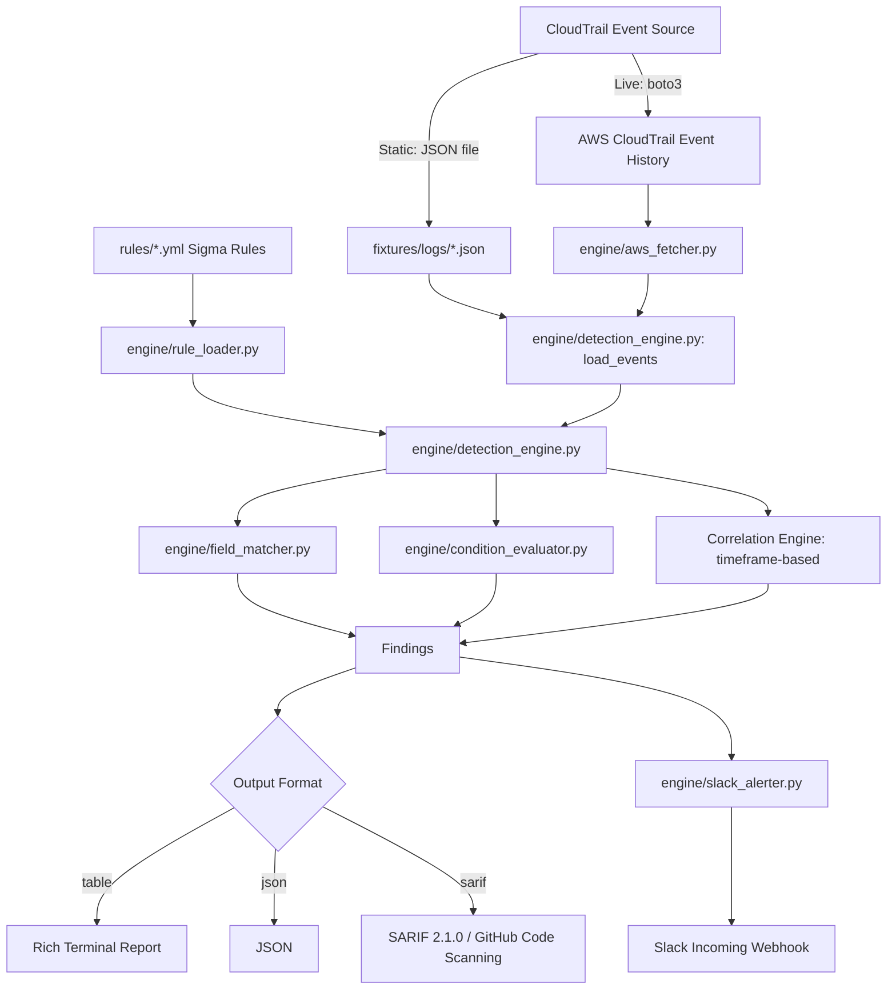
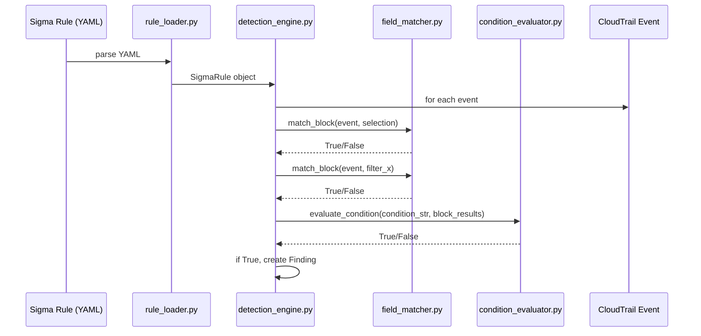
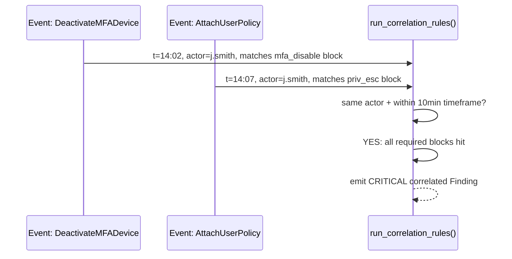

# Architecture

## System overview

```mermaid
flowchart TB
    A[CloudTrail Event Source] -->|Live: boto3| B[AWS CloudTrail Event History]
    A -->|Static: JSON file| C[fixtures/logs/*.json]
    B --> D[engine/aws_fetcher.py]
    C --> E[engine/detection_engine.py: load_events]
    D --> E
    F[rules/*.yml Sigma Rules] --> G[engine/rule_loader.py]
    G --> H[engine/detection_engine.py]
    E --> H
    H --> I[engine/field_matcher.py]
    H --> J[engine/condition_evaluator.py]
    H --> K[Correlation Engine: timeframe-based]
    I --> L[Findings]
    J --> L
    K --> L
    L --> M{Output Format}
    M -->|table| N[Rich Terminal Report]
    M -->|json| O[JSON]
    M -->|sarif| P[SARIF 2.1.0 / GitHub Code Scanning]
    L --> Q[engine/slack_alerter.py]
    Q --> R[Slack Incoming Webhook]
```

## Detection evaluation flow

```mermaid
sequenceDiagram
    participant Rules as Sigma Rule (YAML)
    participant Loader as rule_loader.py
    participant Engine as detection_engine.py
    participant Matcher as field_matcher.py
    participant Cond as condition_evaluator.py
    participant Event as CloudTrail Event

    Rules->>Loader: parse YAML
    Loader->>Engine: SigmaRule object
    Engine->>Event: for each event
    Engine->>Matcher: match_block(event, selection)
    Matcher-->>Engine: True/False
    Engine->>Matcher: match_block(event, filter_x)
    Matcher-->>Engine: True/False
    Engine->>Cond: evaluate_condition(condition_str, block_results)
    Cond-->>Engine: True/False
    Engine->>Engine: if True, create Finding
```

## Correlation engine flow (multi-stage attack detection)

```mermaid
sequenceDiagram
    participant E1 as Event: DeactivateMFADevice
    participant E2 as Event: AttachUserPolicy
    participant Corr as run_correlation_rules()

    E1->>Corr: t=14:02, actor=j.smith, matches mfa_disable block
    E2->>Corr: t=14:07, actor=j.smith, matches priv_esc block
    Corr->>Corr: same actor + within 10min timeframe?
    Corr->>Corr: YES: all required blocks hit
    Corr-->>Corr: emit CRITICAL correlated Finding
```
